# План доработки до готового продукта

> Создан: 17 июня 2026  
> Обновлён: 17 июня 2026  
> Ветка: `feature/mvp-hardening`  
> Цель: полный готовый продукт (не только MVP)

Связанные документы: [IMPROVEMENT_ROADMAP.md](./IMPROVEMENT_ROADMAP.md), [SMOKE_TEST.md](./SMOKE_TEST.md), [SESSION_CONTEXT.md](./SESSION_CONTEXT.md)

---

## Прогресс (6 из 7 фаз)

| Фаза | Статус | Коммит | Тесты |
|------|--------|--------|-------|
| 1. Блокеры запуска | ✅ Готово | `f226f9f` | 40 → 47 |
| 2. Тесты backend | ✅ Готово | `e7041cf` | API + integration |
| 3. Кастомные категории | ✅ Готово | `f3e119c` | +7 API tests |
| 4. Mini App UX | ✅ Готово | `bf6ab14` | build OK |
| 5. UX Telegram-бота | ✅ Готово | `94823d7` | 48/48 |
| 6. Ops / CI/CD | ✅ Готово | `7d1dcab` | 51/51 |
| 7. Напоминания / экспорт / корзина | ⬜ Осталось | — | — |

**CI:** зелёный + ESLint в pipeline  
**Production D1:** миграции `0002`, `0003` применены  
**Deploy:** `.github/workflows/deploy.yml` (push → `main`, нужны secrets)  
**Следующий шаг:** Фаза 7

---

## Решения из обсуждения

- **Главная цель:** выпуск полного готового продукта.
- **Кастомные категории** — обязательная фича v1.0 (не откладывать). Пользователь создаёт свои категории; AI классифицирует по ним динамически.

---

## Текущее состояние

**Сделано (фазы 1–5):**
- Async webhook, LLM fallback, FTS batch, KV rate limit, cleanup
- 48 тестов backend (CRUD, изоляция, integration, categories)
- Кастомные категории: API + AI pipeline + CategoryManager в Mini App
- Mini App: полное редактирование, пагинация, поиск+фильтры, undo, dark theme
- Бот: STT confirm, кнопки после сохранения, undo, inline перемещение
- CI на GitHub Actions (notes-bot + miniapp build)

**Осталось (фаза 7):**
- Напоминания, экспорт JSON/MD, корзина (soft delete)
- Финальный smoke/e2e из `SMOKE_TEST.md`
- Vitest для miniapp (отложен с Фазы 2)
- Создать staging D1 + R2 bucket в Cloudflare (инструкции в `wrangler.jsonc`, `RESTORE.md`)

```mermaid
flowchart LR
  subgraph blockers [Блокеры запуска]
    WebhookAsync[Async webhook]
    DataIntegrity[FTS batch]
    ApiTests[API тесты]
    Backup[Backup D1]
  end
  subgraph categories [Кастомные категории]
    CatTable[categories table]
    CatAPI[CRUD API]
    CatLLM[Dynamic LLM prompt]
    CatUI[Category manager UI]
  end
  subgraph coreUX [Ядро UX]
    EditMeta[Редакт метаданных]
    SearchFilters[Поиск + фильтры]
    Undo[Undo удаления]
  end
  subgraph product [Продукт v1]
    Reminders[Напоминания]
    Export[Экспорт]
    Trash[Корзина]
  end
  blockers --> categories --> coreUX --> product
```



---

## Фаза 1. Блокеры запуска ✅ (P0–P1)

### 1.1 Async webhook ✅

**Файл:** `notes-bot/src/index.ts` — `ctx.waitUntil()` после `claimUpdateId`.

### 1.2 Не терять заметку при сбое LLM ✅

**Файл:** `notes-bot/src/bot/processNote.ts` — fallback → категория `notes` + предупреждение.

### 1.3 FTS + транзакции ✅

**Файл:** `notes-bot/src/db/queries.ts` — `batch` для note+FTS; миграция `0002_fts_backfill.sql`.

### 1.4 Rate limit и cleanup ✅

- [x] `notes-bot/src/util/rateLimit.ts` — KV + memory fallback
- [x] Cron cleanup `processed_updates` (7 дней)

---

## Фаза 2. Тесты ✅ (P1)

- [x] CRUD заметок/папок с mock `initData` (`api-notes`, `api-folders`)
- [x] Изоляция пользователей (чужая заметка → 404)
- [x] FTS search после create/update
- [x] Integration: text, voice, LLM fallback (`integration.spec.ts`)
- [ ] Vitest для miniapp — отложено (CI: только `npm run build`)

---

## Фаза 3. Кастомные категории ✅ (P1, must-have v1.0)

### 3.1 Схема данных ✅

```sql
CREATE TABLE categories (
  id INTEGER PRIMARY KEY AUTOINCREMENT,
  user_id INTEGER NOT NULL,
  slug TEXT NOT NULL,
  name TEXT NOT NULL,
  emoji TEXT DEFAULT '📝',
  color TEXT DEFAULT '#8b5cf6',
  llm_hint TEXT,
  is_system INTEGER DEFAULT 0,
  sort_order INTEGER DEFAULT 0,
  created_at TIMESTAMP DEFAULT CURRENT_TIMESTAMP,
  UNIQUE(user_id, slug)
);
```

- `notes.type` → хранить `slug` категории
- `folders.category` → FK на slug/id категории
- [x] Миграция `0003_categories.sql` + seed для существующих users

### 3.2 Backend API ✅

- [x] `GET/POST/PUT/DELETE /api/categories` — лимит 20, валидация
- [x] Системные (`is_system=1`) нельзя удалить
- [x] Обновлены: `validation.ts`, `notes.ts`, `folders.ts`, `index.ts`

### 3.3 AI-pipeline ✅

- [x] `llm.ts` — динамический промпт из категорий пользователя
- [x] `parser.ts` — валидация slug, fallback → `notes`
- [x] `handlers.ts` / `processNote.ts` — emoji/маппинг папок из categories

### 3.4 Mini App UI ✅

- [x] `CategoryManager` — CRUD категорий
- [x] Динамические `FilterBar`, `NoteComposer`, `NoteCard`, `NoteList`
- [x] `types.ts` — slug вместо жёсткого `NoteType`

### 3.5 Онбординг ✅

- [x] 4 системные категории при `getOrCreateUser`
- [ ] Опциональный шаг «добавь свои категории» — не делали

### 3.6 Тесты ✅

- [x] `api-categories.spec.ts` — 7 тестов

---

## Фаза 4. Mini App UX ✅ (P1–P2)

- [x] `NoteEditor` — текст + категория + папка + теги
- [x] Пагинация: `limit`/`offset`, infinite scroll (30 заметок)
- [x] Поиск с активными фильтрами (категория, тег, папка)
- [x] Undo при удалении (toast 5 сек)
- [x] Pull-to-refresh
- [x] Тёмная тема: `--divider` через `color-mix`
- [x] Safe area, `aria-label`

---

## Фаза 5. UX Telegram-бота ✅ (P2)

- [x] Кнопки «Отменить» / «Mini App» / «Переместить» после сохранения
- [x] Undo последнего сохранения (inline callback)
- [x] Подтверждение STT: «Сохранить» / «Отменить» перед обработкой
- [x] Inline перемещение: категория → папка (`bot/actions.ts`)

---

## Фаза 6. Эксплуатация и CI/CD ✅ (P1)

- [x] Structured logs: `service`, `outcome`, `duration_ms` (`util/logger.ts`, `timed()`)
- [x] D1 backup → R2 (cron 03:00 UTC), `RESTORE.md`, `ops/backup.ts`
- [x] Staging env в `wrangler.jsonc` (`--env staging`, отдельная D1 — создать вручную)
- [x] ESLint (`npm run lint`), автодеплой `.github/workflows/deploy.yml`
- [x] `migrations_dir` в `wrangler.jsonc`
- [x] Per-user daily cap: LLM 50/день, STT 20/день (`util/usageCap.ts`)
- [x] CI GitHub Actions: `tsc` + lint + tests + miniapp build
- [x] `package-lock.json` в репо (fix CI cache)

---

## Фаза 7. Продуктовые фичи v1.0 ⬜ (P2–P3)

| Фича | Описание |
|------|----------|
| Напоминания | `remind_at` + cron → Telegram notification |
| Экспорт | JSON + Markdown через API и Mini App |
| Корзина | Soft delete `deleted_at`, восстановление 30 дней |

**v1.1:** еженедельная AI-сводка, reorder папок в UI, локализация EN.

---

## Не трогать сейчас

- Семантический поиск
- Рефакторинг на микросервисы

---

## Порядок и сроки

```
✅ Фаза 1 (блокеры)              — готово
✅ Фаза 2 (тесты backend)        — готово
✅ Фаза 3 (кастомные категории)  — готово
✅ Фаза 4 (Mini App UX)          — готово
✅ Фаза 5 (бот UX)               — готово
✅ Фаза 6 (ops/CI)               — готово
⬜ Фаза 7 (напоминания/экспорт)  — следующая
⬜ Финальный smoke из SMOKE_TEST.md
```

---

## Definition of Done

- [x] Пользователь создаёт, редактирует и удаляет свои категории; AI классифицирует по ним
- [x] 4 системные категории по умолчанию, можно переименовать
- [x] Заметка не теряется при сбое AI (fallback → `notes`)
- [x] Webhook < 1 сек (`waitUntil`); FTS синхронен с данными (`batch`)
- [x] API + категории покрыты тестами (48); CI зелёный
- [x] Mini App: полное управление заметками и категориями
- [x] Бот: STT confirm, undo, inline move, кнопки после сохранения
- [x] Бэкап D1 (R2 cron), staging config, structured logs
- [ ] R2 bucket + staging D1 созданы в Cloudflare (ручной шаг)
- [ ] Напоминания, экспорт, корзина
- [ ] SMOKE_TEST.md пройден end-to-end

---

## Чеклист задач (краткий)

| # | Задача | Статус |
|---|--------|--------|
| 1 | Async webhook, LLM fallback, FTS batch, rate limit, cleanup | ✅ |
| 2 | API/integration тесты backend | ✅ |
| 3a | Таблица `categories`, миграция, seed | ✅ |
| 3b | CRUD `/api/categories` | ✅ |
| 3c | Динамический LLM prompt и parser | ✅ |
| 3d | CategoryManager, динамический UI | ✅ |
| 4 | Mini App: редактирование, пагинация, поиск, undo, dark theme | ✅ |
| 5 | Бот: undo, кнопки, STT confirm, inline move | ✅ |
| 6 | Metrics, backup, staging, lint, автодеплой | ✅ |
| 7 | Напоминания, экспорт, корзина, smoke/e2e | ⬜ |