```mermaid
flowchart LR
  subgraph blockers [Блокеры запуска]
    WebhookAsync[Async webhook]
    DataIntegrity[FTS batch]
    ApiTests[API тесты]
    Backup[Backup D1]
  end
  subgraph categories [Кастомные категории]
    CatTable[categories table]
    CatAPI[CRUD API]
    CatLLM[Dynamic LLM prompt]
    CatUI[Category manager UI]
  end
  subgraph coreUX [Ядро UX]
    EditMeta[Редакт метаданных]
    SearchFilters[Поиск + фильтры]
    Undo[Undo удаления]
  end
  subgraph product [Продукт v1]
    Reminders[Напоминания]
    Export[Экспорт]
    Trash[Корзина]
  end
  blockers --> categories --> coreUX --> product
```

# План доработки до готового продукта

> Создан: 17 июня 2026  
> Ветка: `feature/mvp-hardening`  
> Цель: полный готовый продукт (не только MVP)

Связанные документы: [IMPROVEMENT_ROADMAP.md](./IMPROVEMENT_ROADMAP.md), [SMOKE_TEST.md](./SMOKE_TEST.md), [SESSION_CONTEXT.md](./SESSION_CONTEXT.md)

---

## Решения из обсуждения

- **Главная цель:** выпуск полного готового продукта.
- **Кастомные категории** — обязательная фича v1.0 (не откладывать). Пользователь создаёт свои категории; AI классифицирует по ним динамически.

---

## Текущее состояние

MVP функционален: AI-pipeline, D1 + FTS, Mini App, security, CI, unit-тесты ядра.

**Главные пробелы:**
- надёжность webhook и fallback при сбое AI;
- целостность FTS и бэкапы;
- API-тесты (CRUD, изоляция пользователей);
- кастомные категории (сейчас 4 жёстких типа);
- незавершённый UX Mini App и бота;
- эксплуатация (staging, мониторинг, автодеплой).



---

## Фаза 1. Блокеры запуска (P0–P1, ~1 неделя)

### 1.1 Async webhook

**Файл:** `notes-bot/src/index.ts`

Webhook ждёт STT + LLM + D1 синхронно. Перенести тяжёлую работу в `ctx.waitUntil()` — сразу `200 OK` после `claimUpdateId`.

### 1.2 Не терять заметку при сбое LLM

**Файл:** `notes-bot/src/bot/handlers.ts`

При ошибке guard/parse заметка теряется. Сохранять сырую заметку с дефолтной категорией и уведомлять пользователя.

### 1.3 FTS + транзакции

**Файл:** `notes-bot/src/db/queries.ts`

`createNote`/`updateNote` — note и FTS отдельно. Обернуть в `batch`, добавить миграцию backfill.

### 1.4 Rate limit и cleanup

- `notes-bot/src/util/rateLimit.ts` → Cloudflare KV
- Cron-очистка `processed_updates` старше 7 дней

---

## Фаза 2. Тесты (P1, ~1 неделя)

Расширить `notes-bot/test/index.spec.ts` и добавить `test/api-*.spec.ts`:

- CRUD заметок/папок с mock `initData`
- Изоляция пользователей (чужая заметка → 404)
- FTS search после create/update
- Integration с mock OpenRouter/Groq/Telegram

Добавить Vitest для miniapp, подключить в `.github/workflows/ci.yml`.

---

## Фаза 3. Кастомные категории (P1, must-have v1.0, ~1–2 недели)

### 3.1 Схема данных

```sql
CREATE TABLE categories (
  id INTEGER PRIMARY KEY AUTOINCREMENT,
  user_id INTEGER NOT NULL,
  slug TEXT NOT NULL,
  name TEXT NOT NULL,
  emoji TEXT DEFAULT '📝',
  color TEXT DEFAULT '#8b5cf6',
  llm_hint TEXT,
  is_system INTEGER DEFAULT 0,
  sort_order INTEGER DEFAULT 0,
  created_at TIMESTAMP DEFAULT CURRENT_TIMESTAMP,
  UNIQUE(user_id, slug)
);
```

- `notes.type` → хранить `slug` категории
- `folders.category` → FK на slug/id категории
- Миграция: seed 4 системных категорий для существующих пользователей

### 3.2 Backend API

Новый `notes-bot/src/api/categories.ts`:

- `GET/POST/PUT/DELETE /api/categories`
- Лимит 20 категорий, валидация slug/name/color
- Системные (`is_system=1`) нельзя удалить

Обновить: `validation.ts`, `notes.ts`, `folders.ts`, `index.ts`

### 3.3 AI-pipeline

- `llm.ts` — динамический промпт из категорий пользователя
- `parser.ts` — валидация slug, fallback → `notes`
- `handlers.ts` — emoji/маппинг папок из categories, не хардкод

### 3.4 Mini App UI

- `CategoryManager` — CRUD категорий
- Динамические `FilterBar`, `NoteComposer`, `NoteCard`
- `types.ts` — slug вместо жёсткого `NoteType`

### 3.5 Онбординг

При создании пользователя — 4 системные категории. Опционально шаг «добавь свои категории».

### 3.6 Тесты

CRUD API, динамический LLM prompt, запрет удаления системных, фильтр по кастомной категории.

---

## Фаза 4. Mini App UX (P1–P2, ~1 неделя)

- Полное редактирование: текст + категория + папка + теги
- Пагинация (API уже поддерживает `limit`/`offset`)
- Поиск с активными фильтрами
- Undo при удалении, pull-to-refresh
- Тёмная тема: исправить `--divider` в `miniapp/src/index.css`
- Safe area, `aria-label`

---

## Фаза 5. UX Telegram-бота (P2, ~3–5 дней)

- Кнопки «Отменить» / «Открыть Mini App» после сохранения
- Undo последнего сохранения (5–10 сек)
- Подтверждение STT-текста перед сохранением
- Inline «Переместить в категорию/папку»

---

## Фаза 6. Эксплуатация и CI/CD (P1, ~1 неделя)

- Structured logs: `duration_ms`, `service`, `outcome`
- D1 backup → R2 (cron), `RESTORE.md`
- Staging env + отдельная D1 в `wrangler.jsonc`
- ESLint, автодеплой, `wrangler d1 migrations`
- Per-user daily cap на LLM/STT

---

## Фаза 7. Продуктовые фичи v1.0 (P2–P3, ~2 недели)

| Фича | Описание |
|------|----------|
| Напоминания | `remind_at` + cron → Telegram notification |
| Экспорт | JSON + Markdown через API и Mini App |
| Корзина | Soft delete `deleted_at`, восстановление 30 дней |

**v1.1:** еженедельная AI-сводка, reorder папок в UI, локализация EN.

---

## Не трогать сейчас

- Семантический поиск
- Рефакторинг на микросервисы

---

## Порядок и сроки

```
Фаза 1 (блокеры)              → 5–7 дней
Фаза 2 (тесты)                → 5–7 дней   [параллельно]
Фаза 3 (кастомные категории)  → 7–14 дней  [ключевая фича]
Фаза 4 (Mini App UX)          → 7 дней     [параллельно с 3.4]
Фаза 5 (бот UX)               → 3–5 дней
Фаза 6 (ops/CI)               → 5–7 дней   [параллельно]
Фаза 7 (напоминания/экспорт)  → 14 дней
Финальный smoke из SMOKE_TEST.md
```

**Итого:** ~6–8 недель последовательно, ~5–6 недель с параллелизацией.

---

## Definition of Done

- [ ] Пользователь создаёт, редактирует и удаляет свои категории; AI классифицирует по ним
- [ ] 4 системные категории по умолчанию, можно переименовать
- [ ] Заметка не теряется при сбое AI
- [ ] Webhook < 1 сек; FTS синхронен с данными
- [ ] API + категории покрыты тестами; CI зелёный
- [ ] Mini App: полное управление заметками и категориями
- [ ] Бэкап D1, staging, мониторинг
- [ ] Напоминания, экспорт, корзина
- [ ] SMOKE_TEST.md пройден end-to-end

---

## Чеклист задач

- [ ] Фаза 1: Async webhook, LLM fallback, FTS batch, KV rate limit, cleanup
- [ ] Фаза 2: API/integration тесты + miniapp tests в CI
- [ ] Фаза 3a: Таблица categories, миграция, seed
- [ ] Фаза 3b: CRUD /api/categories
- [ ] Фаза 3c: Динамический LLM prompt и parser
- [ ] Фаза 3d: CategoryManager, динамический UI
- [ ] Фаза 4: Редактирование, пагинация, поиск+фильтры, undo, dark theme
- [ ] Фаза 5: Undo бота, кнопки, STT confirm, inline actions
- [ ] Фаза 6: Metrics, backup, staging, lint, автодеплой
- [ ] Фаза 7: Напоминания, экспорт, корзина, smoke/e2e